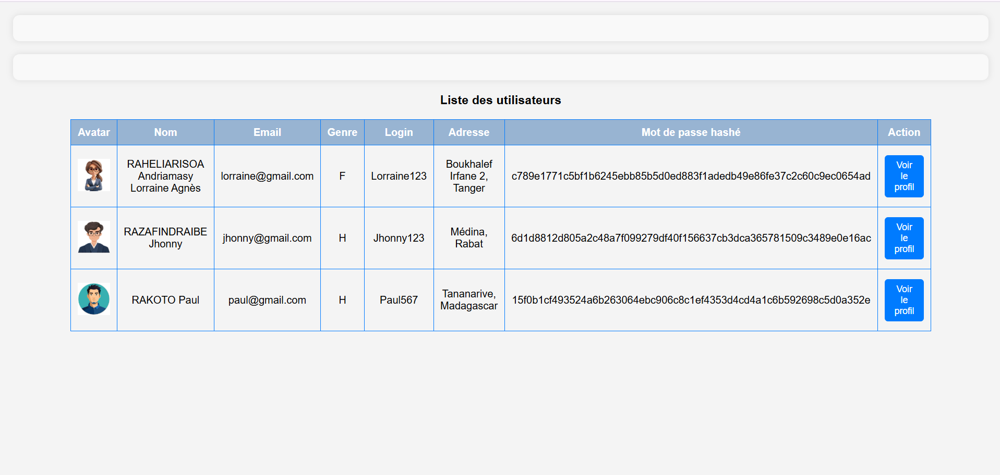
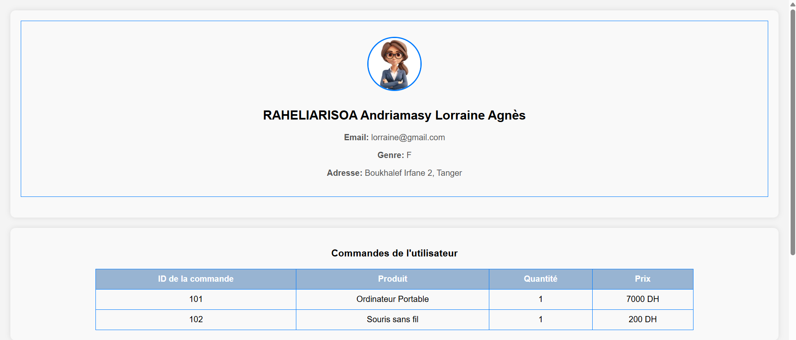

# Atelier5_Programmation_Asynchrone

# Profil Utilisateur et Commandes

Cet exercice permet de créer une application web permettant d'afficher une liste d'utilisateurs et leurs commandes associées. Les utilisateurs peuvent consulter leur profil ainsi que l'historique de leurs achats.

## Fonctionnalités
- Récupération des données utilisateurs après un délai simulé.
- Hachage sécurisé des mots de passe avec SHA-256.
- Affichage des utilisateurs sous forme de tableau avec une option pour voir leur profil.
- Consultation du profil détaillé d'un utilisateur avec son avatar et ses informations personnelles.
- Affichage des commandes passées par l'utilisateur sélectionné.

## Capture d'écran
Voici l'interface de la liste des utilisateurs:



Voici l'interface du profil de chaque utilisateur et leurs commandes:



## Technologies utilisées
- **HTML/CSS** : Pour la structure et le style de l'interface.
- **JavaScript (ES6)** : Pour la gestion des données et l'affichage dynamique.
- **Web Crypto API** : Pour le hachage sécurisé des mots de passe.

## Installation
1. Clonez le dépôt :
   ```bash
   git clone https://github.com/Lorraine301/Atelier5_Programmation_Asynchrone.git
   ```
2. Ouvrez le fichier `index.html` dans un navigateur.

## Structure du projet
```
/
│── images/            # Dossier contenant les avatars des utilisateurs
│── style.css          # Feuille de styles CSS
│── exercice1.js       # Script principal pour la gestion des utilisateurs et commandes
│── index.html         # Page principale
│── README.md          # Documentation du projet
```

## Explication du Code
### `fetchUserOrders(userLogin)`
Cette fonction simule la récupération des commandes d'un utilisateur après un délai de 2 secondes. Elle retourne une liste de commandes selon le login de l'utilisateur.

### `hashPassword(password)`
Utilise la Web Crypto API pour hacher un mot de passe avec l'algorithme SHA-256.

### `fetchUsersData()`
Récupère une liste d'utilisateurs avec un délai simulé et hache leurs mots de passe avant de les stocker.

### `displayUserProfile(user)`
Affiche le profil d'un utilisateur sélectionné dans un conteneur HTML.

### `displayUserOrders(orders)`
Affiche les commandes de l'utilisateur sous forme de tableau HTML.

### `displayUsersTable(users)`
Affiche une liste d'utilisateurs sous forme de tableau avec un bouton permettant de voir leur profil.

### `loadUserProfile(index)`
Charge et affiche le profil et les commandes d'un utilisateur sélectionné.

### `loadUsersData()`
Charge et affiche la liste des utilisateurs au chargement de la page.

## Utilisation
- La page charge automatiquement la liste des utilisateurs après un délai simulé.
- Chaque utilisateur dispose d'un bouton **"Voir le profil"** qui affiche ses informations détaillées et ses commandes.


## Auteur
- **Votre Nom** -Lorraine301

## Licence
Cet exercice est sous licence MIT - voir le fichier [LICENSE](LICENSE) pour plus de détails.


